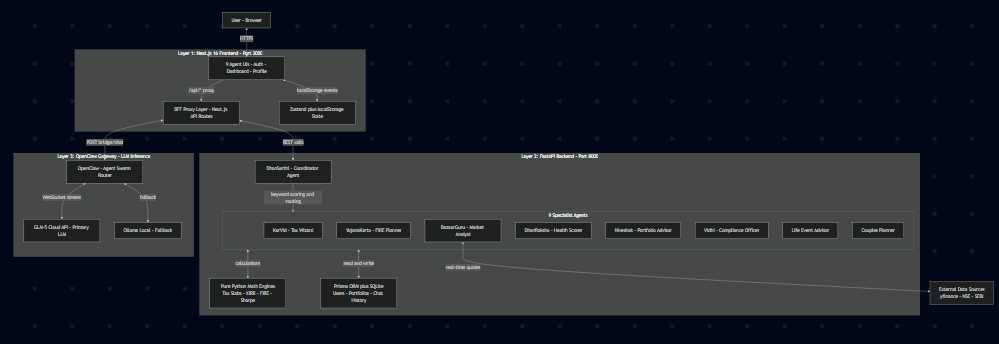
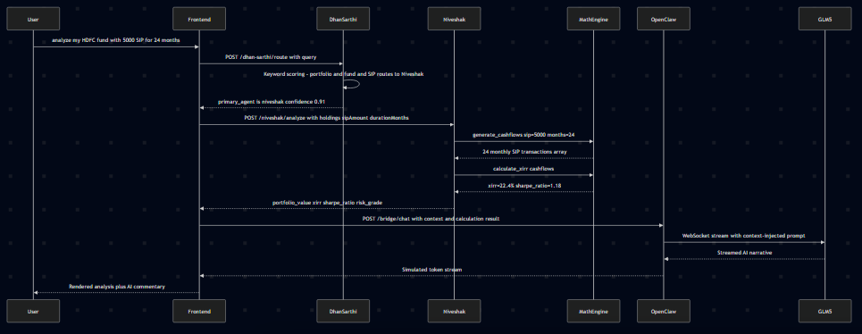
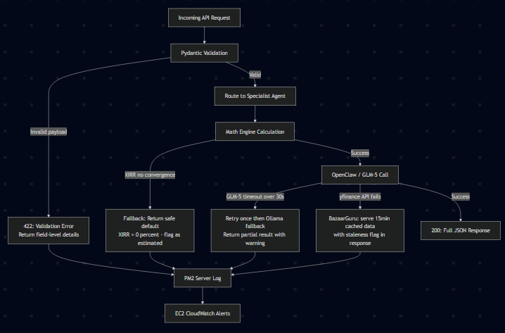
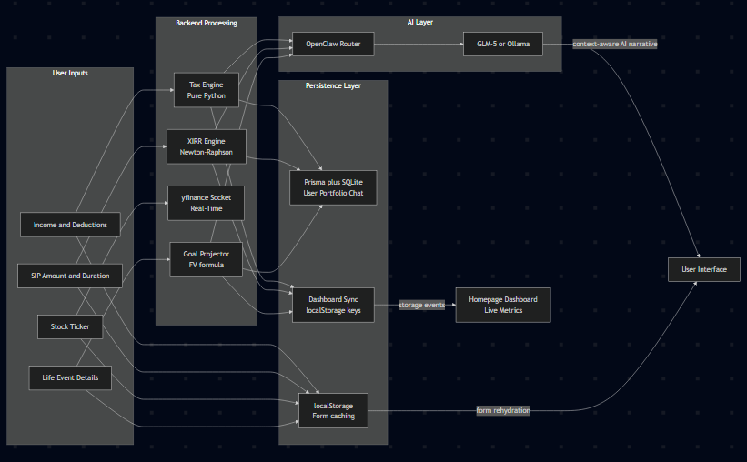

# Architecture Document — AI Money Mentor

> **India's First Multi-Agent Personal Finance AI Platform**
> Built for Hackathon Submission · March 2026 · Devguru Tiwari, IIIT Nagpur

---

## 1. System Overview

AI Money Mentor is a **tri-layer, multi-agent architecture** designed to democratize personal financial planning for 750M+ working Indians who currently lack access to affordable financial advisors. The system is composed of 9 specialized AI agents orchestrated by a central coordinator — **DhanSarthi** — routing queries to the right domain expert, combining deterministic math engines with generative AI reasoning.

---

## 2. High-Level Architecture Diagram

---

## 3. Agent Roles & Responsibilities

| Agent | Domain | Key Tool Integrations | Mathematical Core |
|-------|--------|-----------------------|-------------------|
| **DhanSarthi** | Coordinator | Keyword scoring engine, all 8 specialist agents | 50+ keyword intent classifier with priority boosts |
| **KarVid** | Income Tax | Indian Tax Slab DB, 80C/80D/LTCG calculator | FY2025-26 slab rates, Section 87A rebate, standard deduction |
| **YojanaKarta** | FIRE Planning | SIP calculator, inflation projector | `FIRE = Annual Expenses / 0.04`, `SIP = PV[(1+r)^n - 1] / r` |
| **BazaarGuru** | Stock Market | yfinance real-time API, NSE scraper | Live Market Cap (Cr), P/E Ratio, 52-week range |
| **DhanRaksha** | Financial Health | 8-factor weighted health auditor | Emergency 15%, Savings 20%, Investment 20%, Debt 15% |
| **Niveshak** | Portfolio Analysis | Dynamic SIP matrix generator | Newton-Raphson XIRR, Sharpe Ratio `(Rp - Rf) / σp` |
| **Vidhi** | Legal Compliance | SEBI regulations DB, I-T Act sections | Regulatory lookup engine |
| **Life Event** | Life Milestones | Goal corpus projector | `FV = PV × (1+i)^n` with 10% education inflation |
| **Couple's Planner** | Joint Finance | Income splitter, 50/30/20 model | Proportional, equal and custom splitting modes |

---

## 4. Agent Communication Flow (DhanSarthi Routing)

## 5. Error Handling & Resilience Logic

### Error Handling Strategy

| Failure Mode | Detection | Recovery |
|---|---|---|
| Pydantic field missing | FastAPI validation layer | 422 + field-level error message |
| XIRR non-convergence | try/except in Newton-Raphson loop | Return 0% with `estimated: true` flag |
| OpenClaw socket closed | PM2 process watcher | Auto-restart daemon, re-pair GLM-5 token |
| yfinance rate limit | requests.exceptions catch | Serve 15-min stale cache with `stale: true` flag |
| SQLite write failure | Prisma error boundary | Log + return success (non-blocking for chat) |
| Frontend BFF offline | Next.js 503 route handler | User-facing "Service temporarily unavailable" |

---

## 6. Data Flow Architecture

## 7. Tech Stack Summary

| Layer | Technology | Version | Purpose |
|-------|------------|---------|---------|
| Frontend | Next.js + React | 16.2 / 19 | App Router, SSR, BFF proxy |
| Styling | Tailwind CSS + shadcn/ui | v4 | Responsive, accessible UI |
| State | Zustand + useLocalStorage | 5.x | Persistent form caching + global state |
| Backend | FastAPI + Python | 0.135 / 3.12 | 25+ REST endpoints, math engines |
| ORM | Prisma + SQLite | 5.22 | User profiles, chat, portfolios |
| AI Orchestration | OpenClaw | 2026.3 | Multi-agent swarm coordination |
| LLM | GLM-5 Cloud / Ollama | — | Language reasoning, narrative generation |
| Market Data | yfinance | latest | Real-time Indian stock market data |
| Deployment | AWS EC2 + PM2 | t2.medium | Production server, process management |
| CI/CD | GitHub Actions | — | Automated PyTest + Jest on every PR |

---

*Architecture Document — AI Money Mentor v2.2 — March 28, 2026*
