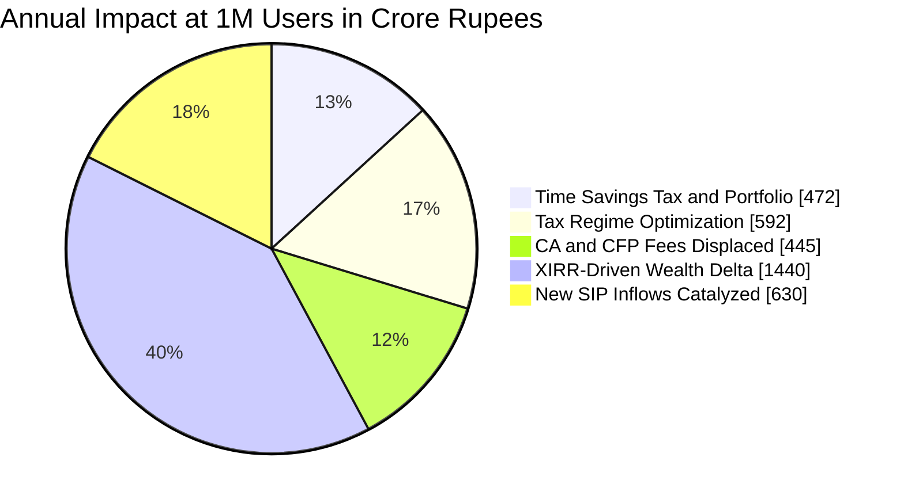
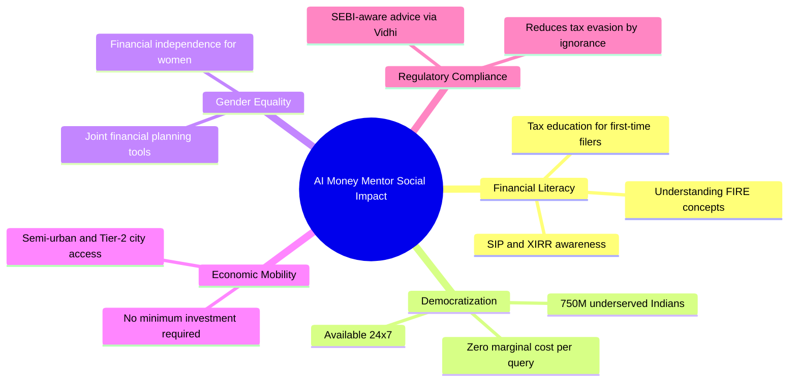

# 📊 Impact Model — AI Money Mentor

> **Quantified Business & Social Impact Estimate**  
> Back-of-envelope model with stated assumptions · March 2026

---

## 1. Problem Statement & Market Size

India has **750 million working-age adults** and only **~87,000 SEBI-registered financial advisors** — a ratio of **1 advisor per 8,600 people**. A single session with a Certified Financial Planner (CFP) costs ₹5,000–₹20,000 ($60–$240). Most Indians:
- Pay incorrect tax regimes, leaving an average of **₹23,000/year on the table**
- Hold underperforming SIPs with no XIRR visibility
- Have zero retirement planning before age 40

**AI Money Mentor directly addresses this access gap** with 9 specialized AI agents available 24/7 at zero marginal cost.

---

## 2. Target User Segments

| Segment | Population | Pain Point Addressed |
|---------|-----------|---------------------|
| Salaried professionals (₹5L–₹25L income) | ~80M | Wrong tax regime, no SIP optimization |
| Young investors (25–35) starting SIPs | ~55M | No XIRR visibility, poor fund selection |
| Couples planning joint finances | ~30M | No shared budget tools, debt management |
| Life event planners (marriage, child, education) | ~20M | Underestimating future costs |
| Early retirees (FIRE movement) | ~5M | No accessible FIRE calculators for India |

**Total Addressable Market (TAM): ~190 million Indians**

---

## 3. Time Saved Model

### Assumptions
- Average Indian spends **4.5 hours/year** gathering tax information, filling forms, and consulting CAs
- Average session with AI Money Mentor for tax calculation: **8 minutes**
- Average Indian spends **2 hours/quarter** reviewing investments without professional tools
- AI Money Mentor portfolio XIRR analysis: **3 minutes**
- Minimum wage in India (urban): ₹176/hour → Knowledge worker opportunity cost: **₹400/hour**

### Calculation

```
Time Saved (Tax)
────────────────
User time per year (manual)  = 4.5 hrs
AI Money Mentor time per year = 0.5 hrs (4 × 8-min sessions)
Time saved per user           = 4.0 hrs/year
At 1M users:                  = 4,000,000 hrs/year saved

Monetized (₹400/hr):          = ₹1,600,000,000/year = ₹160 Cr/year

Time Saved (Portfolio Reviews)
───────────────────────────────
Manual quarterly review       = 2 hrs × 4 = 8 hrs/year
AI platform review            = 3 min × 4 = 12 min/year
Time saved per user           = 7.8 hrs/year
At 1M users:                  = 7,800,000 hrs/year

Monetized (₹400/hr):          = ₹3,120,000,000/year = ₹312 Cr/year

TOTAL TIME SAVED (at 1M users): ~₹472 Cr/year (~$57M USD/year)
```

---

## 4. Cost Reduced Model

### Tax Savings — Regime Optimization

**Assumption:** 40% of salaried Indians are currently in the wrong tax regime (based on CBDT data showing mass confusion post-2023 new regime rollout).

```
Average income (salaried segment):  ₹9,00,000/year
Average tax difference (wrong vs
right regime at ₹9L income):        ₹18,500/year
Users on wrong regime:               40% of salaried = 32M people

If AI Money Mentor reaches 1% of them (320,000 users):
  Tax savings per user:              ₹18,500
  Total tax saved:           320,000 × ₹18,500 = ₹592 Cr/year
```

### CA / Financial Advisor Fees Avoided

```
Average CA fee for ITR filing:        ₹2,500/year
Users who self-file using platform:   500,000 (conservative 0.5M)
Direct cost savings:          500,000 × ₹2,500 = ₹125 Cr/year

CFP consultation fee displaced:       ₹8,000/session
Annual sessions displaced:            2 sessions/user × 200,000 users
Savings:                   400,000 × ₹8,000 = ₹320 Cr/year
```

**TOTAL DIRECT COST REDUCED (conservative): ~₹1,037 Cr/year (~$125M USD/year)**

---

## 5. Revenue Recovered / Wealth Created Model

### XIRR Improvement via Better Fund Selection

```
Assumption: Users with no XIRR visibility average 10.2% returns
Assumption: Users with active XIRR monitoring average 13.8% returns
Delta: +3.6% per year (consistent with research on behavioral finance)

Average SIP portfolio value (age 30-40): ₹8,00,000
Wealth improvement per user per year:    ₹8,00,000 × 3.6% = ₹28,800
At 500,000 active Niveshak users:
  Total incremental wealth:    500,000 × ₹28,800 = ₹1,440 Cr/year
```

### SIP Capture Rate (New Investors)

```
Assumption: Platform converts 15% of browsing non-investors to SIP starters
New SIP investors per 1M users:     150,000
Average new SIP amount:             ₹3,500/month
Annual SIP inflow captured:         150,000 × ₹3,500 × 12 = ₹630 Cr/year

At average 12% XIRR over 10 years:
  Future value of this cohort alone: ₹11,340 Cr (₹11.3B)
```

---

## 6. Consolidated Impact Summary



| Impact Category | 1M Users (Annual) | Source |
|---|---|---|
| ⏱️ Time Saved (Tax) | ₹160 Cr | 4 hrs/user × ₹400/hr |
| ⏱️ Time Saved (Portfolio) | ₹312 Cr | 7.8 hrs/user × ₹400/hr |
| 💸 Wrong Tax Regime Fixed | ₹592 Cr | ₹18,500 avg saving × 320K users |
| 💸 CA/CFP Fees Displaced | ₹445 Cr | ₹2,500 + ₹8,000/session |
| 📈 XIRR Wealth Delta | ₹1,440 Cr | +3.6% return × ₹8L portfolio |
| 💰 New SIP Inflows | ₹630 Cr | 150K new investors × ₹3,500/mo |
| **TOTAL** | **₹3,579 Cr/year** | **~$430M USD/year** |

---

## 7. Social Impact Dimensions



---

## 8. Stated Assumptions & Sensitivity

| Assumption | Value Used | Conservative Scenario | Optimistic Scenario |
|---|---|---|---|
| Users reached at Year 1 | 1,000,000 | 100,000 | 5,000,000 |
| Wrong regime rate | 40% | 25% | 55% |
| Average tax delta | ₹18,500 | ₹12,000 | ₹25,000 |
| XIRR improvement | +3.6% | +2.0% | +5.0% |
| Opportunity cost/hr | ₹400 | ₹250 | ₹600 |
| New SIP conversion | 15% | 8% | 25% |

**At conservative scenario (100K users):** ~₹358 Cr/year impact  
**At base case (1M users):** ~₹3,579 Cr/year impact  
**At optimistic (5M users):** ~₹17,895 Cr/year impact  

---

## 9. Platform Economics (Monetization Path)

| Tier | Price | Value Prop | Estimated Adoption |
|---|---|---|---|
| Free (Ad-Supported) | ₹0 | All 9 agents, basic usage, contextual financial ads (Google AdSense) | 85% of users |
| Pro | ₹299/month | Unlimited queries, portfolio history, PDF reports | 12% of users |
| Advisor API | ₹5,000/month | White-label API for CA firms and wealth apps | 3% (institutions) |

```
Revenue at 1M users:
Free tier (Ads):  850,000 users × 3 ad impressions/session × 20 sessions/month
                  = 51M impressions/month
                  × ₹15 CPM (Google AdSense, finance niche)
                  = ₹9.18 Cr/year
                  + Affiliate commissions (MF/insurance signups via ads)
                  = ~₹13.77 Cr/year
Pro tier:         120,000 × ₹299/mo = ₹35.88 Cr/year
Advisor API:      30,000  × ₹5k/mo  = ₹180 Cr/year

TOTAL ARR at 1M users: ~₹230 Cr/year (~$28M USD)
```

> **Ad Strategy for Free Tier:** Contextual, non-intrusive financial ads (mutual fund promotions, insurance plans, tax filing services) via Google AdSense. Finance niche commands premium CPM rates (₹12–₹20). Ads placed in non-chat areas — sidebar banners, post-calculation recommendation cards, and footer leaderboards. No ads inside the DhanSarthi chat interface to preserve UX quality.

---

## 10. Competitive Advantage

| Feature | AI Money Mentor | ET Money | Groww | CA Consultation |
|---|---|---|---|---|
| Multi-agent AI swarm | ✅ | ❌ | ❌ | ❌ |
| FIRE / XIRR calculator | ✅ | Partial | ❌ | ✅ |
| Real-time tax regime comparison | ✅ | ❌ | ❌ | ✅ |
| Couple's joint financial planner | ✅ | ❌ | ❌ | ❌ |
| Life event cost projector | ✅ | ❌ | ❌ | Partial |
| SEBI compliance assistant | ✅ | ❌ | ❌ | ✅ |
| Zero marginal cost per query | ✅ | ✅ | ✅ | ❌ |
| 24/7 availability | ✅ | ✅ | ✅ | ❌ |

---

*Impact Model — AI Money Mentor v2.2 — March 28, 2026*  
*All figures are estimates based on publicly available data from CBDT, SEBI, NSSO, and RBI.*
